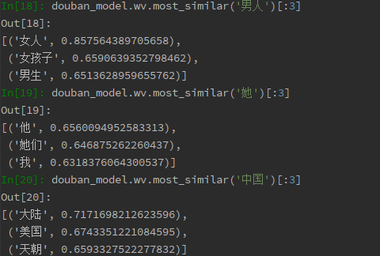

# 基于Seq2Seq Attention的机器自动回复

16307130080 陈旭锋

## 目录

[TOC]

## 问题描述

训练一个神经网络模型，使其能够根据输入的语句，自动生成回复。

选题的动机主要是受日常生活启发。因为平常经常会由于打游戏、看视频等原因，错过一些必须马上回复的微信消息，造成一些我们不太愿意看到的结果，所以希望能够写这么一个自动回复的程序，来应对这种情况。

基于本学期在自然语言处理课程中了解到的语言模型相关的知识，我最终选择使用带注意力的序列模型（sequence-to-sequence with attention）作为实现自动回复功能的理论基础，并使用tensorflow进行开发。

<div style="page-break-after: always;"></div>

## 总体思路

1. 搜集语料，使用word2vec模型训练得到中文字词对应的词向量表示，表现为一个二维的特征向量矩阵。
2. 将中文对话语料进行预处理，对语料中的每一个句子进行分词，再将分词得到的词序列中的每一个词转换为特征向量矩阵中对应词向量的索引。将这些索引组成的序列作为训练的数据集。
3. 创建带注意力的序列模型，使用监督学习的方法对模型进行训练。
4. 运行模型，测试实际的效果。

## 具体过程

### 1. 中文对话语料搜集

解决自然语言处理任务的第一步就是要获取相关的语料。本次任务我使用的语料库来源于GitHub上有人专门整理的一个<a href="https://github.com/codemayq/chinese_chatbot_corpus">中文公开聊天语料库</a>， 包含的语料如下表所示。

| 语料名称                   | 语料数量 | 语料来源说明                         | 语料特点                                                    | 语料样例                                                     | 是否已分词 |
| -------------------------- | -------- | ------------------------------------ | ----------------------------------------------------------- | ------------------------------------------------------------ | ---------- |
| chatterbot                 | 560      | 开源项目                             | 按类型分类，质量较高                                        | Q:你会开心的 A:幸福不是真正的可预测的情绪。                  | 否         |
| douban（豆瓣多轮）         | 352W     | 来自北航和微软的paper, 开源项目      | 噪音相对较少，原本是多轮（平均7.6轮）                       | Q:烟台 十一 哪 好玩 A:哪 都 好玩 · · · ·                     | 是         |
| ptt（PTT八卦语料）         | 40W      | 开源项目，台湾PTT论坛八卦版          | 繁体，语料较生活化，有噪音                                  | Q:为什么乡民总是欺负国高中生呢QQ	A:如果以为选好科系就会变成比尔盖兹那不如退学吧 | 否         |
| qingyun（青云语料）        | 10W      | 某聊天机器人交流群                   | 相对不错，生活化                                            | Q:看来你很爱钱 	 A:噢是吗？那么你也差不多了               | 否         |
| subtitle（电视剧对白语料） | 274W     | 开源项目，来自爬取的电影和美剧的字幕 | 有一些噪音，对白不一定是严谨的对话，原本是多轮（平均5.3轮） | Q:京戏里头的人都是不自由的	A:他们让人拿笼子给套起来了了   | 否         |
| tieba（贴吧论坛回帖语料）  | 232W     | 偶然找到的                           | 多轮，有噪音                                                | Q:前排，鲁迷们都起床了吧	A:标题说助攻，但是看了那球，真是活生生的讽刺了 | 否         |
| weibo（微博语料）          | 443W     | 来自华为的paper                      | 仍有一些噪音                                                | Q:北京的小纯洁们，周日见。#硬汉摆拍清纯照# A:嗷嗷大湿的左手在干嘛，看着小纯洁撸么。 | 否         |
| xiaohuangji（小黄鸡语料）  | 45W      | 原人人网项目语料                     | 有一些不雅对话，少量噪音                                    | Q:你谈过恋爱么	A:谈过，哎，别提了，伤心..。               | 否         |

经处理后得到tsv格式的语料文件：


考虑到语料的数量、噪音等因素，最终我选择使用豆瓣语料作为本次任务的训练数据来源。

### 2. 获取词向量：word2vec

#### 方案1：使用中文wiki训练词向量

想要训练好word2vec模型，一份高质量的中文语料库是必要的。因此为了获取质量更高的词向量，我首先想到的就是使用目前常用的质量较高的维基百科进行训练。

维基百科的中文语料库质量较高，涉及的领域广泛，而且更加开放，每月都会将所有条目打包供大家下载使用。可通过这个网址进行下载：<a href="https://dumps.wikimedia.org/zhwiki/latest/zhwiki-latest-pages-articles.xml.bz2">https://dumps.wikimedia.org/zhwiki/latest/zhwiki-latest-pages-articles.xml.bz2</a>

下载了最新版本的维基百科语料库后，对语料库的进行预处理参考了GitHub项目<a href="https://github.com/lzhenboy/word2vec-Chinese">word2vec-Chinese</a>。整个预处理过程可大致分为以下4步：

1. 格式转换：使用gensim包中的WikiCorpus类读取打包的语料库，并将其转换为txt文本文件。
2. 中文简繁体转换：维基百科语料库中的文档含有繁体中文，因此考虑使用python工具包opencc将繁体转换为简体。
3. 数据清洗：删除语料库中的英文单词和空格。
4. 中文分词：使用jieba分词，将语料库中的中文语料进行分词，以便进行模型的训练。

最后，再使用gensim包中的Word2Vec类来对模型进行训练。

训练出来的模型效果非常好，能非常好的反应中文字词间的相关性，在此选取一些例子以供说明。

<div>

</div>

但是，这个模型最大的缺陷在于，它的词汇表里有约45万个不同的中文单词。训练时，我设置了词向量的长度为300维，因此最后得到的特征向量矩阵大小约为 450000$$ \times $$300 ，直接导致的结果就是如果采用这一模型来设置序列模型的词嵌入层，训练整个Encoder-Decoder模型时，tensorflow会报告OOM错误，也就是说我的GPU性能不足以支撑我对这样的一个模型进行训练。

因此，我只能退而求其次，尝试使用豆瓣语料来训练word2vec模型。

#### 方案2：使用中文对话语料库进行训练

因为豆瓣语料已经预先经过了分词处理，所以我在训练模型时省略了上述的预处理步骤，直接从语料库中读取词序列对word2vec模型进行训练。

相比于维基百科一个多G的语料库，豆瓣的对话语料库源文件的大小只有80多M，无论是在质量上还是在规模上都要比维基百科的中文语料库逊色很多。然而如下图所示，训练后对模型进行测试，考察它的训练效果，最后得到的效果仍然能够比较好的体现词汇间的关联性。

<div>

</div>


最终得到的词汇表中词汇量随着训练数据的减少，也骤减至6万个词汇左右，约为原来的1/9，大大降低了运行时对设备的性能要求。

综合考虑了模型性能和对设备的要求之后，我认为使用这一模型来对带注意力的序列模型进行词嵌入不失为一个可行的选择，以下步骤的展开也都将建立在使用这一模型的基础上。

### 3. 生成数据集

1. 限定对话的句子长度：

	本次任务主要面向的还是日常化的简短的交流、对话，因此过长的对话对于这个模型的训练应该是没有帮助的。所以，在生成数据集的过程中，首先就要过滤掉这些例子。（在本次任务的代码实现中，我设置了忽略分词之后，词序列长度大于25 的句子）

2. 给句子加上开始和结束标记:

  对于输入的训练数据，需要人为在句子的首末两端加上开始、结束标记，以便模型知道何时开始和结束预测。

  本次任务中使用的标记分别为``` ’<start>’``` 和```’<end>’```。

2. 将对话语料库中的词汇转换成对应词向量的索引:

  在本次任务所使用的序列模型中，词嵌入层的作用相当于维护一个词汇表的词向量矩阵。根据输入的词汇在词汇表中的索引，输出其在矩阵中对应行的词向量。因此，为了将语料输入模型来进行训练，第一步就需要将语料中的词序列转换为词的索引的序列。

4. 限制数据集的大小以加快实验速度：

	受我自己的机器的性能限制，一旦数据集过大，训练所需时间就会变得非常长。为了加快训练的速度，降低训练时间，我将数据集的大小限制在了10万个句子（尽管如此，训练一次模型也需要6个多小时）。

5. 划分训练集、测试集：

	为了测试模型在不同数据集上的表现，验证模型的鲁棒性，将数据集按4:1的比例划分为训练集和测试集

### 4. 定义模型

关于如何实现一个Encoder-Decoder模型，我参考了Tensorflow的官方教程<a href="https://www.tensorflow.org/tutorials/text/nmt_with_attention">基于注意力的神经机器翻译</a>。

整个模型的结构大致如下图所示。

<div>

</div>

带注意力的序列模型是一个Encoder-Decoder结构的网络，针对序列进行运算，输入一个序列，输出一个序列。Encoder为输入的序列中的每一个单词输出一个向量。Decoder使用注意力机制为每个输入单词分配一个权重，根据这些权重对Encoder输出的向量进行加权平均，得到一个表征输入序列信息的上下文向量（context vector），再将这一向量用于预测句子中的下一个单词。

下面将分别描述Encoder，Decoder的实现思路。

#### Encoder

1. 模型创建代码：

	

2. 模型运算过程：

	Encoder首先使用一层词嵌入层来对输入的单词序列进行词嵌入，再将得到的词向量输入一层循环神经网络（RNN）进行运算（这里使用GRU来作为RNN的实现），最后将RNN的输出和隐状态作为整个Encoder的输出。

#### Decoder

1. 模型创建代码：

	

2. 模型运算过程：

	Decoder与Encoder的网络结构非常相似，二者的区别仅仅在于Decoder多了一个attention层来实现注意力机制，和一个fc层来将RNN的输出转化为词汇表中的某一个单词。

	如上述模型结构图中所示，Decoder以Encoder中RNN的隐状态来初始化模型中RNN的隐状态。同时，接收Encoder中RNN的输出，使用BahdanauAttention注意力机制对其进行处理，得到上下文向量。最后，根据上下文向量和模型预测出的前一个单词，使用单层循环神经网络预测下一个单词，再使用一个完全连接层fc将预测结果转换为词汇表中对应的单词。

在数据集和模型结构都已经准备完毕之后，下一步就是要对模型进行训练。

### 5. 训练模型

在训练模型时，还是遇到了跟之前一样的问题——电脑运算性能的限制。

对于本次任务涉及的Encoder-Decoder模型，可供设置的参数主要有两个，一个是上下文向量的维数layer_size，另一个是批大小batch_size。layer_size适当增大，就能更精确的反映整个序列的上下文信息，模型最终效果就越好；batch_size尽可能大，模型在相同的迭代次数内，在数据集上训练的周期就越多，能更快的达到训练目标。

然而，GPU性能的不足使我在本次任务中只能将这两个参数设置为两个较小的值，layer_size为128，batch_size为32。

为了能使模型训练的过程可视化，我在训练过程中通过将损失函数的值写入日志的方式为tensorboard提供了支持。得到的训练集上损失函数随迭代次数变化的图像如下所示。


同时，为了验证模型的鲁棒性，在每一个周期（epoch）的训练结束之后，我还使用测试集对模型进行了测试，得到了测试集上的平均损失随训练周期变化的图像如下。


可以非常明显的看到，尽管随着训练步数的增加，训练集上的损失函数在不断减小，但同时模型的鲁棒性也变得越来越差。再加上在第14个周期之后，训练集上损失函数的下降速度也明显放缓，综合考虑下，我在第15个周期中断了模型的训练。

### 实际运行效果

#### 运行截图

<div display="block">

</div>

#### 说明

1. 因为模型在训练过程中是存在一个词汇表的，对于不在词汇表中的单词模型是没有办法识别的。因此在处理输入时，一旦发现有不在词汇表中的中文单词，我就设置了直接输出” 我不知道你在说什么 “。

	而在获取词向量的时候也提到过，使用豆瓣语料训练的word2vec模型只含有6万个词汇左右，因此在实际测试中其实会经常碰到” 我不知道你在说什么 “这样的回答。

2. 其实在训练过程中发现测试集上损失函数不断增大，我心里就已经有了一种不好的预感，最后实际测试得到的效果也确实差强人意。

	个人感觉原因主要应该在于三个方面。

	1. 我尝试了很多次，总共大概训练了五六个模型，但是测试集上的损失函数始终会随着训练不断增大。我觉得最关键的一点还是在于模型的本身，上下文向量的维数太小，以至于不足以精确的表征序列的上下文信息，才导致始终无法在测试集上得到一个鲁棒的解。
	2. 另外，出于加快训练时间的考虑，我限制了数据集的数量为10万个对话，因此训练数据的不足可能也是原因之一。
	3. 最后，可能在语料库的选取上也会更优的选择。我之后打开语料库的源文件进行了检查，发现豆瓣的语料其实跟日常生活中的对话还是有不小的差距的。所以如果能够找到更符合任务应用场景的语料来进行训练应该

## 总结

本次项目尽管做了很多的尝试，但是由于时间原因以及电脑性能的限制，非常遗憾，我最终还是没有能够训练出一个令人满意的模型。

这次是我第一次通过查阅官方文档的方式，从无到有一步步搭建了模型，并进行了训练，感觉自己在这一过程中学到的东西、得到的锻炼还是非常有价值的。希望以后有机会能够对这个模型进行进一步的完善，得到一个不错的结果。

## 代码

项目代码已全部上传至GitHub，可通过以下链接查看：

https://github.com/XufengCh/nlp-project

同时，为了证明这是我本人的GitHub站点，相关信息我已在README中进行了注明。

## 参考资料

1. 中文公开聊天语料库 <a href="https://github.com/codemayq/chinese_chatbot_corpus">https://github.com/codemayq/chinese_chatbot_corpus</a>
2. word2vec-Chinese <a href="https://github.com/lzhenboy/word2vec-Chinese">https://github.com/lzhenboy/word2vec-Chinese</a>
3. 基于注意力的神经机器翻译 <a href="https://www.tensorflow.org/tutorials/text/nmt_with_attention">https://www.tensorflow.org/tutorials/text/nmt_with_attention</a>